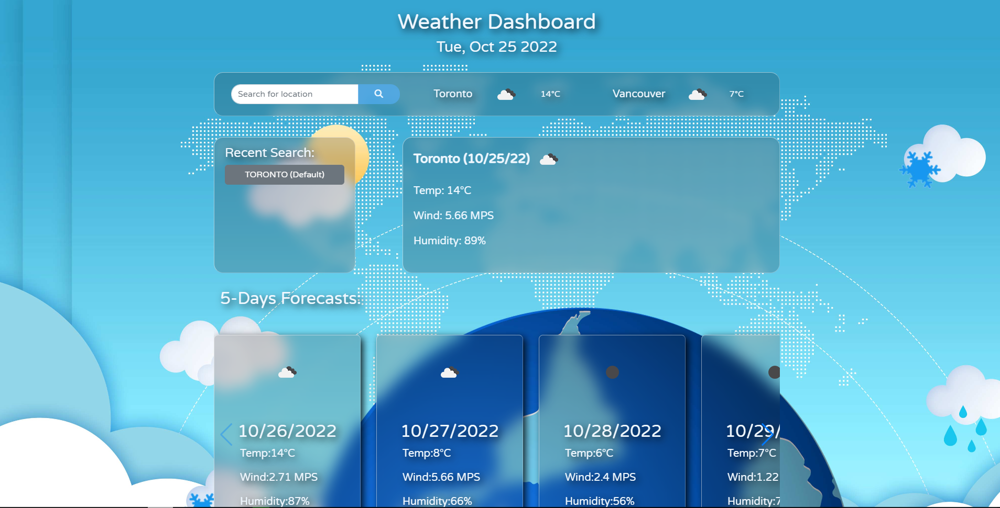

# Weather Dashboard (challenge 6)

## Description
This application is a weather dashboard. Users can search for a city. Then, the app will present the city's current weather conditions and 5-days forecast.

Technology:Server-Side APIs：‘openWeather’, bootstrap5.2.2, jquery, swiper, moment.

## My_Web_Img

## Web_Page_Link
https://hpyorange.github.io/weatherDashboard/